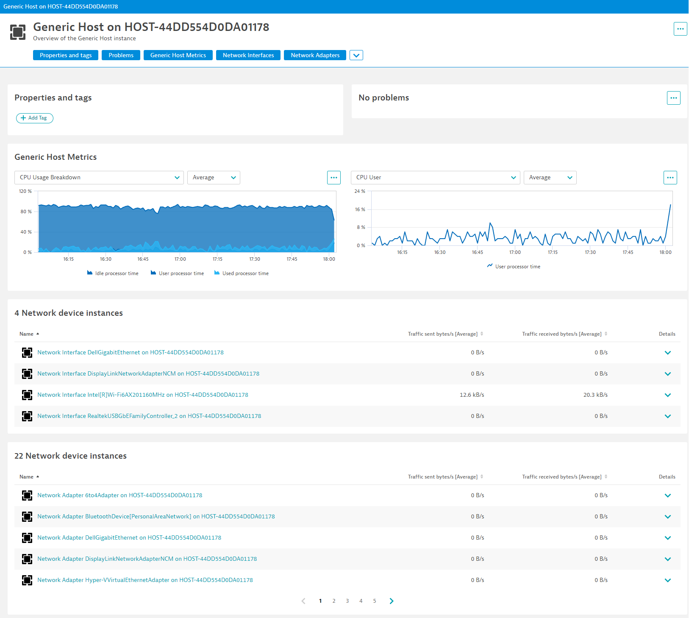

# Exercise 5 - Unified Analysis Screens
---

## Description
Unified Analysis screens are the window into performance analysis and troubleshooting for this newly monitored technology. 
It's an opportunity to eliminate the need for further dashboarding or ad-hoc chart building. The `screens` section will 
define the details to be displayed on each entity's page as well as charts and lists of other related entities for quick 
drilldowns.

The details page is organised into `staticContent` and a `layout` for dynamic content that comprises of `cards` (charts 
and lists).
`staticContent`
* `showProblems` - show a panel for any Problems about this entity
* `showProperties` - show the "Properties and tags" section
* `showTags` - show the tags applied to this entity
* `showGlobalFilter` - show the global filtering bar
* `showAddTag` - show the "Add Tag" button

The `layout` consists of different cards defined in the `chartsCards` and `entitiesListCards` sub-sections.

**Charts cards**

A chart card is a section of the screen which displays charts. All possible charts are defined in the card, and a number of them can be displayed at the same time on the screen. The others are available from the dropdown above the chart.

Charts cards rely on [metric selectors](https://www.dynatrace.com/support/help/dynatrace-api/environment-api/metric-v2/metric-selector) to correctly display metrics.

Simple chart card example:
```yaml
chartsCards:
  - key: "host-cpu-metrics"
    displayName: "Host CPU"
    numberOfVisibleCharts: 2
    charts:
      - displayName: "Idle CPU"
        metrics:
          - metricSelector: "custom.demo.host-observability.host.cpu.time.idle:SplitBy()"
      - displayName: "User CPU"
        metrics:
          - metricSelector: "custom.demo.host-observability.host.cpu.time.user:SplitBy()"

```

**Entities list cards**

An entity list is a list of entities that are somehow related to the currently viewed entity. Additional metrics can be charted in the detail of each returned entity and will show as a single value in the list view.

Entity lists rely on [entity selectors](https://www.dynatrace.com/support/help/dynatrace-api/environment-api/entity-v2/entity-selector) to correctly list out related entities.


Simple entity list example:
```yaml
entitiesListCards:
  - key: "nic-list"
    displayName: "Network Interfaces"
    entitySelectorTemplate: "type(wmi:generic_network_device),fromRelationships.runsOn($(entityConditions)),wmi_network_type(Interface)"
    displayCharts: false
    displayIcons: true
    enableDetailsExpandability: true
```

**Note:** `$(entityConditions)` is a function that automatically maps to the currently viewed entity. This is mandatory for entity selectors used in the extension.

**The properties card**

The `propertiesCard` of an entity can also be modified to include additional properties or hide unnecessary ones. Properties are extracted from entity attributes (when type is `ATTRIBUTE`) or through an entity selector (when type is `RELATION`).

## Tasks
1. Add the `screens` section to your `extension.yaml`
2. Customize the details page settings for both the Generic Host and the Generic Network Device entity types.
3. Use charts cards to display all the metrics of each entity
4. Add entity list cards so that a Generic Host can list out all Network Adapters and Interfaces running on it
5. Add a relation based property so that a Gneric Network Device displays what Generic Host it runs on
6. Package and upload a new version of your extension
7. Validate your screens are showing up as expected

## Results
You have completed this exercise when your customized unified analysis screens are displayed and populated as expected.



---
## [Next exercise ▶](../6_Assets)

#### [◀ Previous exercise](../4_Generic-Topology)