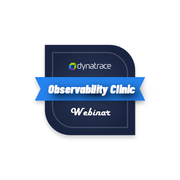

  

# Unified Analysis - Observability Clinic Materials

Everything you've seen or heard being mentioned in the Unified Analysis episode of the Observability Clinic Webinar.

In case you missed it, watch the episode **[here](https://www.youtube.com/watch?v=tIIVaC9iWPM)**

## Contents

* ### [EasyTaxis Demo Application](easytaxis-demo-app)
  
  The load generator that was used in the hands-on portion of the episode. It ingests observability data which emulates a Fleet of Smart Taxis.

* ### [Extension Project Starter](extensions-project-starter)

  The VS Code project structure and convenience scripts used in the hands-on portion of the episode.

* ### [WMI Extension 2.0 Tutorial](wmi-extension-tutorial)

  A guided lab taking you from A to Z steps of building your first WMI Extension 2.0. This is a complete lab to get you hands on with Extensions 2.0, the WMI Datasource, Generic Topology, and Unified Analysis.
  
  
  
## Don't forget to also check out

* #### [dt-cli - the Extension 2.0 developer's toolbox](https://github.com/dynatrace-oss/dt-cli)
* #### [Extensions 2.0 documentation](https://www.dynatrace.com/support/help/extend-dynatrace/extensions20/extensions-concepts)
* #### [Extensions 2.0 blog post](https://www.dynatrace.com/news/blog/new-snmp-platform-extensions-provide-observability-at-scale-for-network-devices)
